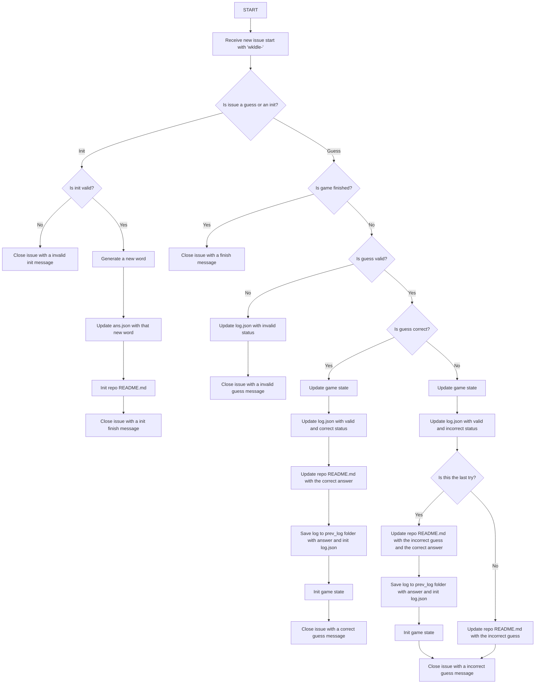
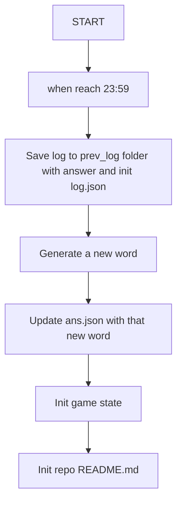

Main Game Flow

```mermaid
graph TD
start[START] --> new_issue[Receive new issue start with 'wkldle-']
new_issue --> guess_or_init{Is issue a guess or an init?}
guess_or_init --> |Init| is_valid_init{Is init valid?}
is_valid_init --> |No| close_issue_init_invalid[Close issue with a invalid init message]
is_valid_init --> |Yes| new_word[Generate a new word]
new_word --> save_new_word[Update ans.json with that new word]
save_new_word --> init_readme[Init repo README.md]
init_readme --> close_issue_init[Close issue with a init finish message]
guess_or_init --> |Guess| is_finished{Is game finished?}
is_finished --> |Yes| close_issue_finish[Close issue with a finish message]
is_finished --> |No| is_valid{Is guess valid?}
is_valid --> |No| update_log_invalid[Update log.json with invalid status]
update_log_invalid --> close_issue_guess_invalid[Close issue with a invalid guess message]
is_valid --> |Yes| is_correct{Is guess correct?}
is_correct --> |Yes| update_game_state_correct[Update game state]
update_game_state_correct --> update_log_correct[Update log.json with valid and correct status]
update_log_correct --> update_readme_correct[Update repo README.md with the correct answer]
update_readme_correct --> save_and_init[Save log to prev_log folder with answer and init log.json]
save_and_init --> init_game_state_correct[Init game state]
init_game_state_correct --> close_issue_correct[Close issue with a correct guess message]
is_correct --> |No| update_game_state_incorrect[Update game state]
update_game_state_incorrect --> update_log_incorrect[Update log.json with valid and incorrect status]
update_log_incorrect --> is_last_try{Is this the last try?}
is_last_try --> |Yes| update_readme_finish[Update repo README.md with the incorrect guess and the correct answer]
update_readme_finish --> save_last_try_and_init[Save log to prev_log folder with answer and init log.json]
save_last_try_and_init --> init_game_state_last_try[Init game state]
init_game_state_last_try --> close_issue_incorrect[Close issue with a incorrect guess message]
is_last_try --> |No| update_readme_incorrect[Update repo README.md with the incorrect guess]
update_readme_incorrect --> close_issue_incorrect
```

Daily Game Flow

```mermaid
graph TD
start[START] --> day_pass[when reach 23:59]
day_pass --> save_and_init[Save log to prev_log folder with answer and init log.json]
save_and_init --> new_word[Generate a new word]
new_word --> save_new_word[Update ans.json with that new word]
save_new_word --> init_game_state[Init game state]
init_game_state --> init_readme[Init repo README.md]
```
